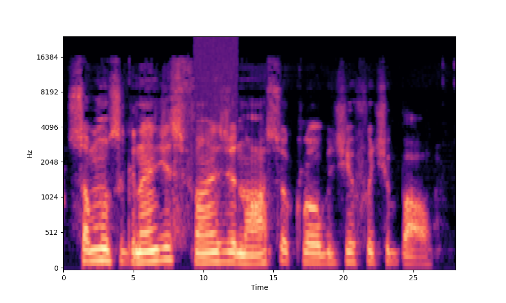

# QE-for-S2TT

This repository contains the implementation of an unsupervised, black-box method for Quality Estimation of Speech-to-Text Translation systems. It is perturbation based and uses prediction robustness under manipulation of the source audio as an indicator for quality.

The `Perturbation.py` file contains an audio Perturbation framework which is independently usable. Find out more about it in the [Section about Perturbation](#audio-perturbation).

## Installation

1. Set up a virtual environment including Python >= 3.11.
2. Use a package manager (e.g. pip) to install the requirements for your system. For a 64-bit Windows machine without NVIDIA CUDA run `pip install -r requirements_windows_noCuda.txt`. For the bwUniCluster (v2), a linux machine with CUDA, do the same using `requirements_cluster.txt`.

## Inference

To run inference, you need

- a valid model key and
- a path to an audio file.

You _may_ additionally configure

- source and target languages (the language keys you give must be compatible with the model you pass)
- desired metric to use (out of BLEU, TER and CHRF)
- as_corpus [boolean]: whether you'd like pairwise or corpus-like translation similarity calculation
- a path to a config file.

If no configuration or specific instructions are given, the default configuration in `default_config.py` is used.

```
python ./inference.py \
 --model facebook/seamless-m4t-v2-large \
 --audio ./audio_original.wav \
 --source_lang por \
 --target_lang deu
```

If running on the bwUniCluster (v2), we provide the `test_inference.sh` job script, for which only user setup-specific pathing has to be additionally configured.

### Models

The pre-embedded models are OpenAI's Whisper (`key: whisper`), Meta's SeamlessM4T-v2 (`key: facebook/seamless-m4t-v2-large`)and a trivial predictor (`key: stupid_model`). Manually adding models requires a model implementation and inserting model loading and inference methods in the designated sections of `ModelWrapper.py`.
Be advised that each model may vary in the mainfestation of its language keys (e.g. `whisper: 'en'`, but `seamless: eng`).

### Configuration

A configuration cosists of

- the metric (choice of BLEU, TER and CHRF)
- as_corpus (whether corpuslike translation similarity calculation should be applied)
- a dict/JSON Object of weights (contents will be ignored if corpuslike, if pairwise then an empty dict means all weights are equal)
- a dict/JSON Object of perturbations to perform.

This repository contains multiple example perturbations for reference.

#### Perturbation Specification

The perturbation specification is a dict/JSON object. It may contain the keys `resampling`, `random_noise`, `frequency_filtering` and `speed_warp`. The values of the respective keys have to correspond to the respective perturbation method's specifications. An example os provided below.

```
{
    "perturbation": {
        "resampling": {
            "target_sample_rates": [21000, 25000]
        },
        "frequency_filtering": {
            "stop_cutoffs": [
                [100, 3000],
                [50, 200]
            ],
            "pass_cutoffs": [
                [300, 5000],
                [1000, 7000]
            ],
        },
        "random_noise": {
            "std_ns": [0.01, 0.1]
        },
        "speed_warp": {
            "speeds": [0.7, 1.7]
        }
    }
}
```

The weight keys are given as `<perturbation_key>-<spec>`. For the example above this results in `random_noise-0.1` and `frequency_filtering-pass(300,5000)` (among others).

## Evaluation

To run an evaluation manually, you only need a model key. However, you _may_ customize

- source and target languages (make sure the keys match the models)
- the configuration using a config JSON file
- the result file destination and
- the CSV input file.

The provided evaluation script is built to process the IWSLT23 dataset. To evaluate on a different set, some changes regarding the assumptions made about the CSV's columns have to be made manually.

```
python evaluation.py \
 --model "facebook/seamless-m4t-v2-large" \
 --input ./eval_prep/IWSLT23_with_files.csv
```

If running on the bwUniCluster (v2), we provide the `eval_seamless.sh` and `eval_seamless_single.sh` job scripts, for which only user setup-specific pathing has to be additionally configured.

# Audio Perturbation

Our implemented Perturbator class can perform frequency band filtering, resampling, warping and noising on any passed numpy audio. We use the following resources to perform the perturbations:

- [resampy](https://github.com/bmcfee/resampy)
- [scipy.fft](https://docs.scipy.org/doc/scipy/tutorial/fft.html)
- [pydub](https://github.com/jiaaro/pydub)
- [numpy](https://numpy.org/)

The specification of which exact perturbations should be performed has the same format as in QuESTT. More detailed instruction can be found in the [Section on Perturbation Specifiation](#perturbation-specification).

_Original and pydub-trimmed audio_:

<p>
  
&nbsp; &nbsp; &nbsp; &nbsp;
  
</p>

_Warping at factors 0.5 and 2.0_:

<p>
  
&nbsp; &nbsp; &nbsp; &nbsp;
  
</p>

_Added Gaussian noise and aliasing from resampling well below the Nyquist rate_:

<p>
  
&nbsp; &nbsp; &nbsp; &nbsp;
  
</p>

_Band pass and band stop filtered audio_:

<p>
  
&nbsp; &nbsp; &nbsp; &nbsp;
  
</p>

_Segment-wise filter and noise perturbation on segment 4_:

<p>
  
&nbsp; &nbsp; &nbsp; &nbsp;
  
</p>
